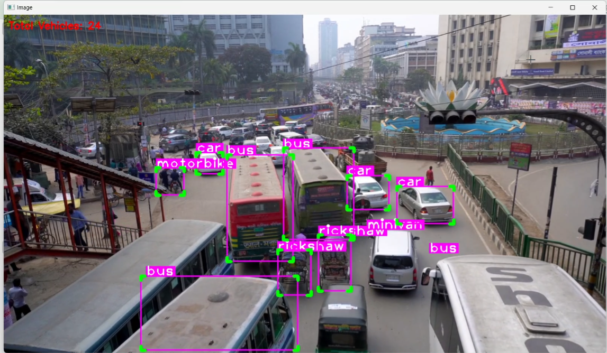
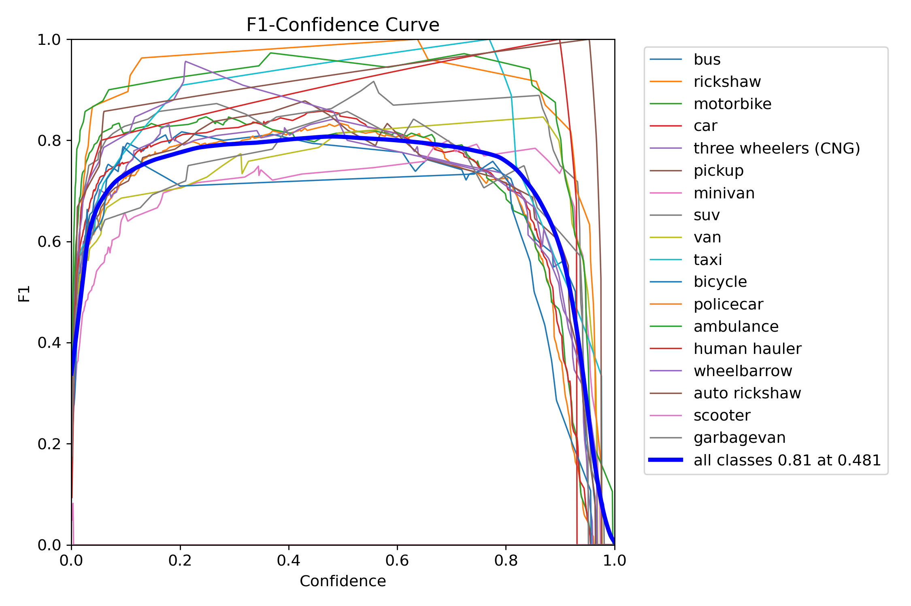
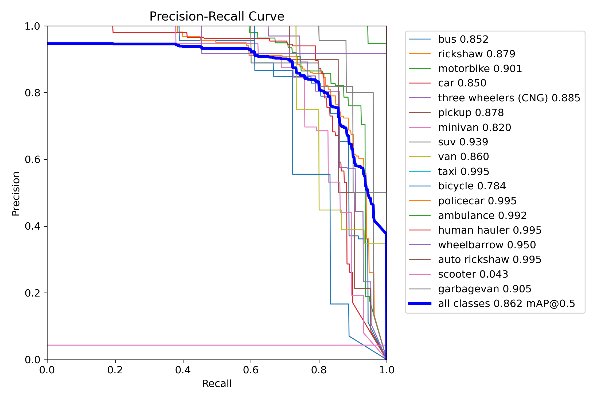
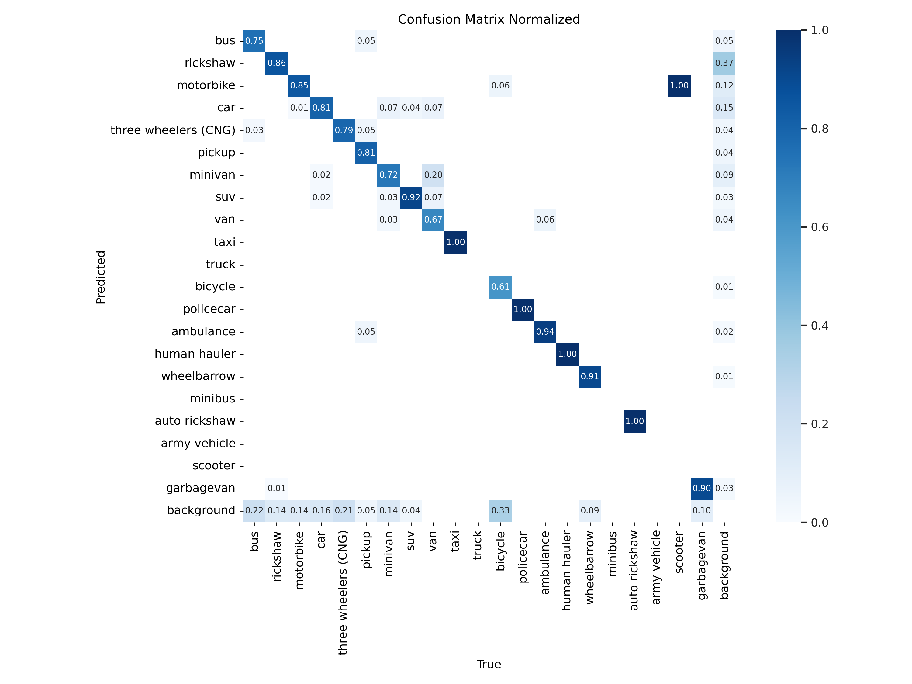
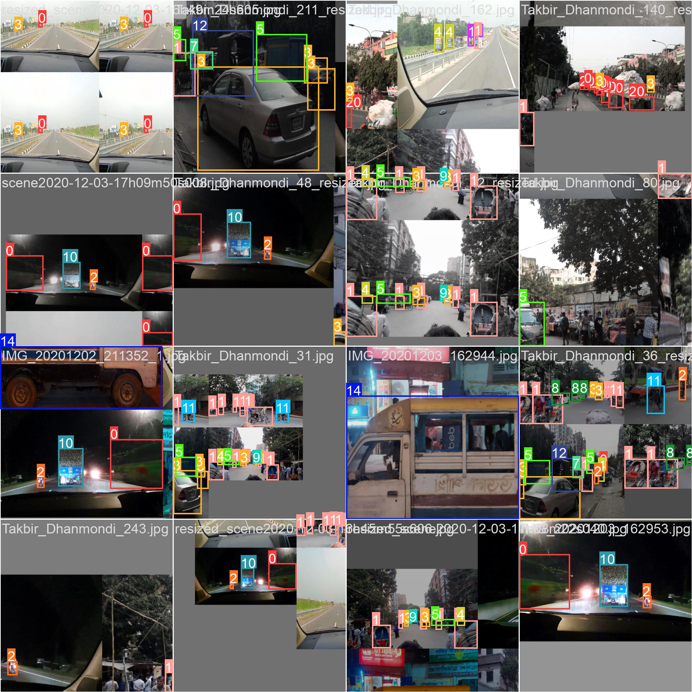
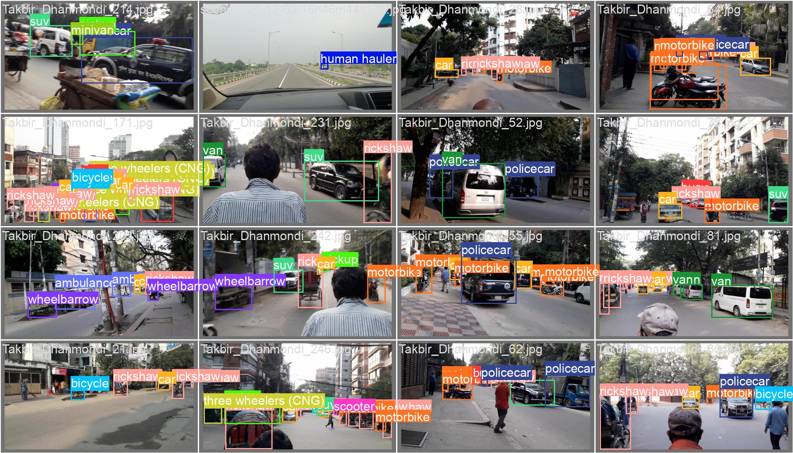

# **Bangladeshi Vehicle Counter**

A machine learning project using the YOLOv8n model to detect and count different types of vehicles commonly found in Bangladesh in real-time. This tool aims to provide insights into traffic flow by identifying vehicle types and their counts, although it is not yet 100% accurate.

---

## **Table of Contents**

1. [Overview](#overview)
2. [Demo Video](#demo-video)
3. [Screenshots](#screenshots) 
4. [Features](#features)  
5. [Dataset](#dataset)  
6. [Model Performance](#model-performance)  
7. [Technologies Used](#technologies-used)  
8. [Installation and Usage](#installation-and-usage)  


---

## **Overview**

The **Bangladeshi Vehicle Counter** detects and counts 18 types of vehicles commonly seen on Bangladeshi roads, including:  

- Bus, Rickshaw, Motorbike, Car, Three-Wheelers, Minivan, SUV, Pickup, Van, Taxi, Police Car, Bicycle, Ambulance, Human Hauler, Wheelbarrow, Auto Rickshaw, Scooter, Garbage Van  

This model can analyze video footage in real-time and produce vehicle count summaries, offering insights for traffic management and road usage analysis.

---

##  **Demo Video**
[](./screenshots/bangladeshi_vehicle_counter.mp4)  
*Click on the image to view it in a larger size.*


## **Screenshots**

### 

| Real Time Detection |
|----------|
| 

### **Accuracy Graphs and Training Metrics**

| F1 Curve | PR Curve | Confusion Matrix |
|----------|----------|------------------|
|  |  |  |
| Train Batch | Validation Batch |
|  |  |


---

## **Features**

- **Real-Time Detection and Counting**  
  Detects and counts vehicles from video streams or footage in real-time.

- **Vehicle Types Covered**  
  Covers 17 types of vehicles frequently seen in Bangladesh.

- **Analytics & Metrics**  
  Includes precision-recall (PR) curves, confusion matrices, and other training metrics.

- **Google Colab Integration**  
  Developed and trained on Google Colab for fast prototyping.

---

## **Dataset**

The dataset used contains labeled images of various Bangladeshi vehicles, annotated to suit the YOLOv8n model. The dataset was split into:  

- **Training Data**: 80%  
- **Validation Data**: 20%  

Classes included:  
Bus, Rickshaw, Motorbike, Car, Three-Wheelers, Minivan, SUV, Pickup, Van, Taxi, Police Car, Bicycle, Ambulance, Human Hauler, Wheelbarrow, Auto Rickshaw, Scooter, Garbage Van.

---

## **Model Performance**

Key metrics from training:  

- **F1 Curve**:  
  For all classes, the F1 score is **0.64** at a confidence threshold of **0.458**.

- **Precision-Recall (PR) Curve**:  
  For all classes, the mean Average Precision (mAP@0.5) is **0.664**.

- **Confusion Matrix (Normalized)**:  
  Demonstrates classification accuracy across different classes.

- **Other Metrics**:  
  Includes precision, recall, and loss metrics from training and validation phases.

---


---

## **Technologies Used**

- **Machine Learning Model**: YOLOv8n  
- **Development Environment**: Google Colab  
- **Programming Language**: Python  
- **Libraries**:  
  - `ultralytics` for YOLOv8 model  
  - `OpenCV` for video processing  
  - `Matplotlib` for visualization  

---

## **Installation and Usage**

1. **Clone the Repository**  
   ```bash
   git clone https://github.com/AshikurRahman3/Bangladeshi-Vehicle-Counter.git

2. **Set up Environment**

    Install the required dependencies:
    ```
    pip install -r requirements.txt

3. **Run the Model**

4. **Output**

    Real-time vehicle count and detection visualized on the video.

## **Developer**

Developed by [Ashikur Rahman](https://github.com/AshikurRahman3).  
Feel free to explore my other projects on GitHub!


